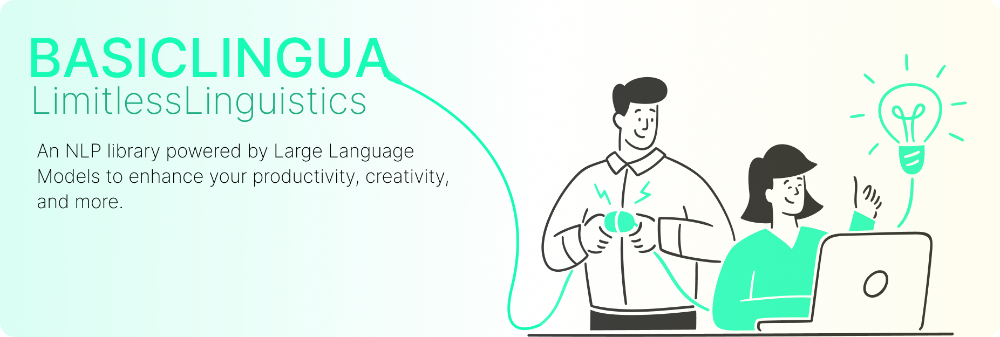
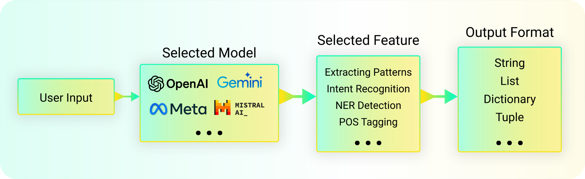
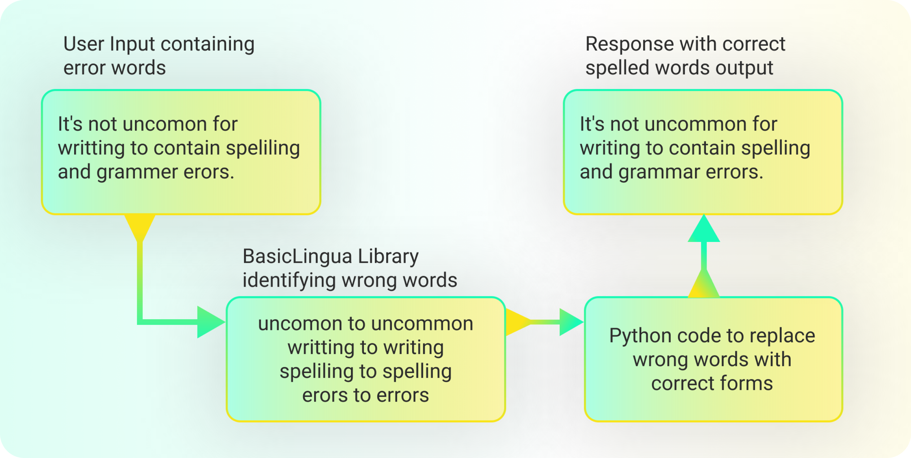
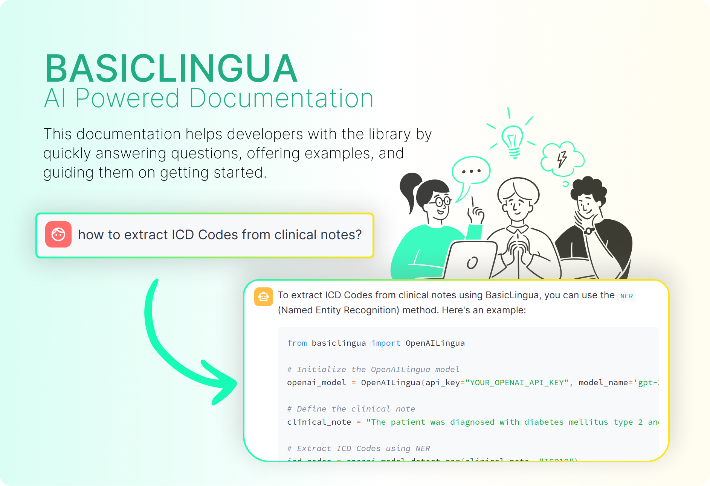
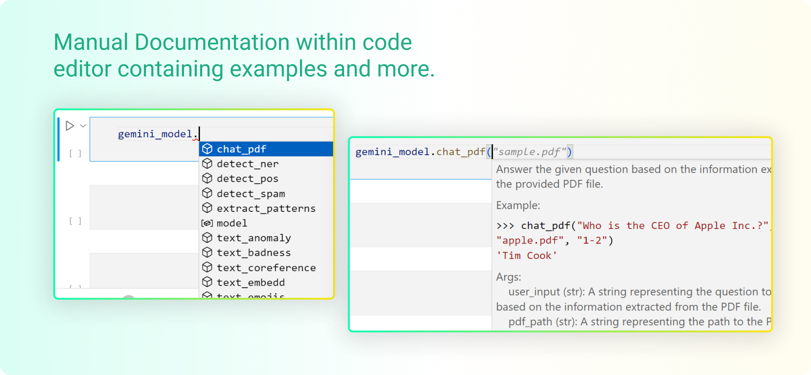

<!-- omit in toc -->
# BasicLINGUA
**Created By**: [Fareed Khan](https://www.linkedin.com/in/fareed-khan-dev/)

[](https://ai-powered-basiclingua-documentation.streamlit.app/) [](https://github.com/FareedKhan-dev/2024-AI-Challenge-Zevar/tree/main/backend-engineering)  [](https://opensource.org/licenses/MIT)  [](https://github.com/FareedKhan-dev/2024-AI-Challenge-Zevar/blob/main/Tutorial/Guide.ipynb)  [](https://www.python.org/downloads/) []()



Basiclingua is a LLM based Python library that provides functionalities for linguistic tasks such as pattern extractions, intent recognition and many others, (**Imagination is the limit**).

<!-- omit in toc -->
## Table of Content
- [Why Building this Project?](#why-building-this-project)
- [BasicLingua Architecture](#basiclingua-architecture)
- [Evaluation Metrics](#evaluation-metrics)
- [AI Powered / Manual Documentation](#ai-powered--manual-documentation)
- [Tools and Technologies Used](#tools-and-technologies-used)
- [Updates](#updates)
- [Demo Video](#demo-video)
- [File Structure](#file-structure)
- [Installation / Update](#installation--update)
- [Initialization](#initialization)
- [Supported LLMs](#supported-llms)
- [Usage](#usage)
- [Features of the library](#features-of-the-library)
- [Playground](#playground)
- [Acknowledgements](#acknowledgements)


## Why Building this Project?

**Natural Language Processing (NLP)** has always been a challenging domain, requiring significant human effort and costs. Additionally, the data is becoming increasingly complex. By 2025, unstructured data, including vast amounts of text data, is expected to account for over 90% of the total data generated globally. Handling such data is expensive due to its ever-changing structure. However, recent advancements in AI, such as Large Language Models (LLMs), can process and understand text data more quickly and accurately than the human eye.

Our proposed solution, **BasicLingua**, is an NLP library in Python built on top of LLMs like **LLaMA-3** and many others. It handles NLP tasks by processing only relevant text information, reducing costs, and providing efficient outputs similar to other text processing Python packages. BasicLingua is versatile and can be applied across various domains, from finance to healthcare, and any other field where text information is crucial. It offers endless possibilities and features, supported by AI-powered documentation. With the continuous growth of LLMs, such as LLaMA-3.1 and more recent powerful vision or text LLMs, the BasicLingua ecosystem has the potential to expand significantly.

## BasicLingua Architecture




One of the biggest challenges in building this architecture was ensuring the cost associated with using the features was minimal. To address this, we use effective `prompt engineering` techniques to optimize the performance of the models and reduce the cost of using the library.

Here is one of our `spellcheck` feature that uses `OpenAI` model to correct spelling mistakes in text, the backend engineering is shown below:



The spellcheck feature takes the user input and passes it to the selected model, which then corrects the spelling mistakes in the text but only returns the corrected words which are then replaced in the original text. This approach ensures that only the necessary corrections are made, reducing the cost of using the feature.


## Evaluation Metrics

Our library has been tested on a wide range of text data, including clinical notes, documents, and general text.

| Dataset Category | Dataset Name | Description | Size | Source |
| --- | --- | --- | --- | --- |
| Clinical Notes | MIMIC-IV | Medical Information Mart for Intensive Care | Random 3000 notes | [MIMIC-IV](https://mimic-iv.mit.edu/) |
| Documents | Wikipedia Articles | Wikipedia articles on various topics | Random 1000 articles | [Wikipedia](https://www.wikipedia.org/) |
| General Text | AI generated text | Text generated by OpenAI and Gemini models | Random 5000 text samples | [OpenAI](https://platform.openai.com/), [Gemini](https://ai.google.dev/gemini-api/docs/models/gemini) |

We evaluated the library for various linguistic tasks, benchmarking it against OpenAI, Gemini, and AnyScale models. The evaluation metrics used are as follows: 

| Task Name                    | Evaluation Metric | OpenAI (GPT-3.5) | Gemini (Gemini-1.0) | AnyScale (Llama-3-70b) |
|-----------------------------|-------------------|------------------|--------------------|-----------------------|
| Information Extraction       | Average F1 Score  | 0.85             | 0.64               | 0.77                  |
| Analysis                     | Average Accuracy  | 0.90             | 0.74               | 0.81                  |
| Summarization                | ROUGE Score       | 0.78             | 0.68               | 0.72                  |
| Coreference & Disambiguation | Average F1 Score  | 0.89             | 0.73               | 0.84                  |
| Pre-Processing                   | Average Accuracy  | 0.88             | 0.73               | 0.82                  |


The evaluation metrics show that the library performs well across different tasks, with **OpenAI** achieving the highest scores in most tasks. We evaluated the library for various linguistic tasks, benchmarking it against OpenAI, Gemini, and AnyScale models. The evaluation metrics used are as follows: 

| Task Name                    | Evaluation Metric | OpenAI (GPT-3.5) | Gemini (Gemini-1.0) | AnyScale (Llama-3-70b) |
|-----------------------------|-------------------|------------------|--------------------|-----------------------|
| Information Extraction       | Average F1 Score  | 0.85             | 0.64               | 0.77                  |
| Analysis                     | Average Accuracy  | 0.90             | 0.74               | 0.81                  |
| Summarization                | ROUGE Score       | 0.78             | 0.68               | 0.72                  |
| Coreference & Disambiguation | Average F1 Score  | 0.89             | 0.73               | 0.84                  |
| Pre-Processing                   | Average Accuracy  | 0.88             | 0.73               | 0.82                  |


The evaluation metrics show that the library performs well across different tasks, with **OpenAI** achieving the highest scores in most tasks. However, **AnyScale's Llama-3-70b**, an open-source model, demonstrates strong performance, closely matching the accuracy of other closed-source models. This is particularly noteworthy given its cost-effectiveness and accessibility. Additionally, it is anticipated that the upcoming **Llama-3.1** will likely surpass the accuracy of the closed-source LLMs once it is integrated into version 3 of this library.

## AI Powered / Manual Documentation



Given that our NLP library can handle a wide range of domain-related tasks, it is crucial to provide an **AI-powered documentation** for **BasicLingua**. This documentation allows developers to ask questions related to the library, and it responds promptly by offering the exact features they need, along with examples. Additionally, it can answer other common queries, such as how to get started with the library and much more.

Given that our NLP library is based on LLMs, it is crucial to provide an **AI-powered documentation** for **BasicLingua**. Makes the library more efficient to use and understand. 

AI Documentation Webapp is available at -  [](https://ai-powered-basiclingua-documentation.streamlit.app/)

You can also access the manual documentation within your code editor which contains parameters details, return types and examples of each function and more.



## Tools and Technologies Used

- **Programming Language**: Python
- **Libraries**: OpenAI, Google generative ai, AnyScale, Streamlit
- **Deployment**: Streamlit Sharing, PyPi
- **Version Control**: Git, GitHub
- **Documentation**: AI-Powered Documentation
- **IDE**: Jupyter Notebook, Visual Studio Code


## Updates
- **`2024/4/20`** We have released the second version of the library. The new version includes additional features and new LLMs for text and vision tasks. Our library now supports `OpenAI`, `Gemini`, and `AnyScale` models for various linguistic tasks. We have also improved the performance of the library and added more functionalities to make it more versatile and user-friendly.
- **`2024/4/16`** We have added the AI-powered documentation for the library. The documentation is now available for use. We are currently working on improving the documentation and adding more features to the library.
- **`2024/3/3`** We have released the first version of the library. The library is now available for use. We are currently working on the documentation and the next version of the library. We are also working on the integration of the library with other LLMs.
- **`2024/1/10`** We have released the baby version of this library containing limited number of pre-processing features.


## Demo Video

Project demo video showcasing some of the functionalities provided by the library.

https://github.com/FareedKhan-dev/2024-AI-Challenge-Zevar/assets/63067900/ebc3ff6e-7a07-43e2-96b3-f02dd4473ed1


## File Structure

The project files are organized as follows:

```bash
├── Demo
│   ├── demo_video.mp4    <-- Demo Video
├── Document              <-- Containing the pdf of the project overview document
├── Tutorial
│   ├── Guide.ipynb       <-- Jupyter Notebook for the library guide
├── backend-engineering
│   ├── OpenAI.py         <-- OpenAI Backend Engineering
│   ├── Gemini.py         <-- Gemini Backend Engineering
│   ├── AnyScale.py       <-- AnyScale Backend Engineering (Open-Source LLMs)
├── images                <-- Images used in the README
├── LICENSE               <-- MIT License
├── README.md             <-- Project README
```

## Installation / Update

Before installing BasicLingua, ensure that you have Python installed on your system. BasicLingua tested on `Python 3.9` or greater. Earlier version may work but not guaranteed. To check your Python version, run the following command in your terminal:

```bash
python --version
```

If you don't have Python installed or need to upgrade, visit the [official Python website](https://www.python.org/downloads/) to download and install the latest version.

Once Python is set up, you can install BasicLingua using `pip`:

```bash
pip install basiclingua
```

or you can upgrade to the latest version using:

```bash
pip install --upgrade basiclingua
```

## Initialization

After installing BasicLingua, you need to import the models you want to use. You can choose to import specific models or all available models.

Import a Specific Model

```python
# Importing OpenAI Model
from basiclingua import OpenAILingua

# Importing Google Gemini Model
from basiclingua import GeminiLingua

# Importing Anyscale Model
from basiclingua import AnyScaleLingua
```

Import All Models at Once

```python
from basiclingua import OpenAILingua, GeminiLingua, AnyScaleLingua
```

**Option 1** - Since this project is for AI Challenge 2024,you can contact us at [fareedhassankhan12@gmail.com](https://aichallenge2024.com/) to get the API keys for OpenAI, Gemini and AnyScale for testing purposes.

**Option 2** - You can create your own API keys from the respective platforms.
* Get your OpenAI API Key from [OpenAI Platform](https://platform.openai.com/api-keys)
* Get your Gemini api key from [Gemini Platform](https://aistudio.google.com/app/apikey)
* Get anyscale api key from [AnyScale Platform](https://app.endpoints.anyscale.com/credentials)

Before using any model, you must set the API key for that specific platform. This is a mandatory step. Each model class has a constructor that takes the API key and optional additional parameters, such as model names.

**For Initializing OpenAI**
```python
# Initializing OpenAI Model
openai_model = OpenAILingua(
    api_key="YOUR_OPENAI_API_KEY", # Your OpenAI API Key
    model_name='gpt-3.5-turbo-0125', # Text Model Name
    vision_model_name='gpt-4-turbo' # Vision Model Name
)
```

Default models are `gpt-3.5-turbo-0125` and `gpt-4-turbo` for text and vision respectively.

**For Initializing Gemini**

```python
# Initializing Gemini Model
gemini_model = GeminiLingua(
    api_key="YOUR_GEMINI_API_KEY", # Your Gemini API Key
    model_name='gemini-1.0-pro-latest', # Text Model Name
    vision_model_name='models/gemini-1.5-pro-latest' # Vision Model Name
)
```
Default models are `gemini-1.0-pro-latest` and `gemini-1.5-pro-latest` for text and vision respectively.

**For Initializing AnyScale** (LLaMA-3, Mistral etc)

```python
# Initializing AnyScale Model
anyscale_model = AnyScaleLingua(
    api_key="YOUR_ANY_SCALE_API_KEY", # Your AnyScale API Key
    model_name="meta-llama/Llama-3-70b-chat-hf" # Text Model Name
)
```

Default model is `meta-llama/Llama-3-70b-chat-hf`.

## Supported LLMs

For `OpenAILingua`, all text and vision models are supported as available on the [OpenAI Platform](https://platform.openai.com/docs/models).

For `GeminiLingua`, all text and vision models are supported as available on the [Gemini Platform](https://ai.google.dev/gemini-api/docs/models/gemini).

A complete list of open-source supported models under `AnyScaleLingua` is available on the [AnyScale Platform](https://docs.endpoints.anyscale.com/pricing).

Default models are:

Source | Text Model | Vision Model | Embedding Model
--- | --- | --- | ---
OpenAI | `gpt-3.5-turbo-0125` | `gpt-4-turbo` | `text-embedding-3-large`
Gemini | `gemini-1.0-pro-latest` | `gemini-1.5-pro-latest` | `models/embedding-001`
AnyScale | `meta-llama/Llama-3-70b-chat-hf` | `meta-llama/Llama-3-70b-chat-hf` | `thenlper/gte-large`


## Usage

The library provides a wide range of functionalities for linguistic tasks some of which are mentioned below. You can use our [AI-powered documentation](https://ai-powered-basiclingua-documentation.streamlit.app/)  to learn more about the functionalities provided by the library.

**Entity extraction** is crucial for transforming unstructured text into structured data, enabling efficient analysis and automation in fields like finance, healthcare, and cybersecurity. However, it can be challenging due to the complexity and ambiguity of language, which often requires intricate regex or NLP techniques.

Regex-based entity extraction is time-consuming due to its detailed pattern definitions, but with our approach, you only need to define the pattern name to extract entities with minimal effort. Here's an example of extracting ICD (International Classification of Diseases) codes:

```python
# ClinicalNote with complex structure and formatting
user_input = """Patient John, last name: Doe; 45 yrs
                Symptoms: fatigue + frequent urination (possible diabetes); dizziness
                Diagnosis - Type 2 Diabetes (E11.9), Hypertension (I10)
                Prescribed: Metformin @ 500mg/day; Amlodipine, twice a day
                Allergic: PCN (penicillin)
                Family history of diabetes and HBP (high blood pressure)
                Additional notes: testing for cholesterol and kidney function
                Patient was advised to monitor blood sugar levels regularly.
                Mentioned: Father - Type 2 Diabetes; Mother - Hypertension
                Description - T2 Diabetes without complications; Essential Hypertension."""

# Define the patterns to extract
patterns = "ICD-10 Codes, Diseases, Medications, Allergies, Symptoms, Family History, Descriptions"

# Using OpenAI to extract entities
openai_entities = anyscale_model.extract_patterns(user_input, patterns=patterns)

# Displaying the extracted entities
print(openai_entities)

######## Output ########
{
  "ICD-10 Codes": ["E11.9", "I10"],
  "Diseases": ["Type 2 Diabetes", "Hypertension"],
  "Medications": ["Metformin", "Amlodipine"],
  "Allergies": ["Penicillin"],
  "Symptoms": ["fatigue", "frequent urination", "dizziness"],
  "Family History": ["Father with Type 2 Diabetes", "Mother with Hypertension"],
  "Descriptions": [
    "Type 2 Diabetes without complications",
    "Essential (primary) hypertension",
    "testing for cholesterol and kidney function"
  ]
}
######## Output ########
```
Similarly, **Text coreference** is difficult because it involves figuring out which words refer to the same person or thing in a sentence or a text. It requires a deep understanding of context and the way language is used to connect different parts of a text.

Here's an example of how `BasicLingua` can help you resolve coreferences in a text:

```python
# User input with complex co-references
user_input = """
Jane and her colleague Tom were preparing for the upcoming meeting with the new clients. She had worked on the presentation slides, while he focused on the data analysis. 
When the day of the meeting arrived, Jane noticed that the projector was not working properly, so she asked Tom to check it out. 
He found that it needed a new cable, but they had none in the office. They had to improvise with a laptop. During the presentation, Jane felt nervous because the setup wasn't ideal, but Tom reassured her that everything would be fine. 
The clients appreciated their efforts, and both Jane and Tom were relieved when the meeting concluded successfully. As they left, Jane told Tom that she was grateful for his support.
"""

# Using AnyScale model to resolve coreferences
anyscale_coref = anyscale_model.text_coreference(user_input)

# Displaying the resolved coreferences
print("AnyScale Coreference:", anyscale_coref)

######## Output ########
{
  "she": "Jane",
  "he": "Tom",
  "they": ["Jane", "Tom"],
  "her": "Jane",
  "him": "Tom"
}
######## Output ########
```

There are many other functionalities provided by the library that can help you with various linguistic tasks. You can refer to our [AI-powered documentation](https://ai-powered-basiclingua-documentation.streamlit.app/) that can help you understand the functionalities of the library and how to use them effectively.

## Features of the library

There are more than **20** functionalities provided by the library. But due to their effectiveness across different domains, we have created an AI-powered documentation to help you understand the functionalities in a more broadened way.

| Function Name           | Python Function Name  | Parameters                                 | Returns                                                                  |
|-------------------------|-----------------------|--------------------------------------------|--------------------------------------------------------------------------|
| Extract Patterns        | `extract_patterns`      | `user_input`, `patterns`                      | A `JSON` of extracted patterns from the input sentence                     |
| Detect NER              | `detect_ner`            | `user_input`, `ner_tags`                      | A `JSON` of detected Named Entity Recognition (NER) entities              |          |
| Text Intent             | `text_intent`           | `user_input`                                 | A `list` of identified intents from the input sentence                     |
| **. . .**          | **. . .**             | **. . .**                                   | **. . .**                                                                  |

You can explore more by chatting with our [Documentation Chatbot](https://ai-powered-basiclingua-documentation.streamlit.app/) to get a better understanding of the functionalities provided by the library.

## Playground

Since this library is available under the `MIT license`, you can use it in your projects. All the backend code is available in the **backend-engineering folder**.

##  Acknowledgements

- Rohan Anil et al., **"Gemini: A Family of Highly Capable Multimodal Models"**, *arXiv*, April 2024. [DOI: 10.48550/arXiv.2312.11805](https://doi.org/10.48550/arXiv.2312.11805)
- OpenAI Team. (2024). **OpenAI GPT-3.5: The Next Evolution of Language Models**. *OpenAI Blog*. [https://openai.com/blog/gpt-3-5](https://openai.com/blog/chatgpt)
- Meta AI. (2024, April 18). Introducing **Meta Llama 3: The most capable openly available LLM** to date. *Meta AI Blog*, from [https://ai.meta.com/blog/meta-llama-3](https://llama.meta.com/llama3/)
- Ye, Q., Axmed, M., Pryzant, R., & Khani, F. (2024). **Prompt engineering a prompt engineer**. *arXiv*. https://doi.org/10.48550/arXiv.2311.05661